# CampusSpace - 校园场地智能预约管理系统应用构建案例

# 一、概述

## 1.1 案例介绍

CampusSpace是一个基于Django框架开发的校园场地智能预约管理系统，旨在解决高校场地预约管理中的痛点问题。系统集成了智能推荐算法、冲突自动检测、批量审批等核心功能，支持教室、实验室、会议室等多种场地类型的预约管理，为校园场地资源的高效利用提供了一站式解决方案。

本案例将指导开发者从零开始构建一个功能完整的校园场地预约系统，涵盖用户管理、场地管理、预约审批、智能推荐、数据统计等核心模块，并集成华为云OBS对象存储、Redis缓存等技术，提升系统性能和用户体验。

## 1.2 适用对象

- 高校学生（学习Web开发、系统设计）
- 个人开发者（构建校园应用）
- 企业开发者（了解Django框架、华为云服务集成）

## 1.3 案例时间

本案例总时长预计90分钟，包括环境准备（15分钟）、项目构建（50分钟）、测试验证（25分钟）。

## 1.4 案例流程

**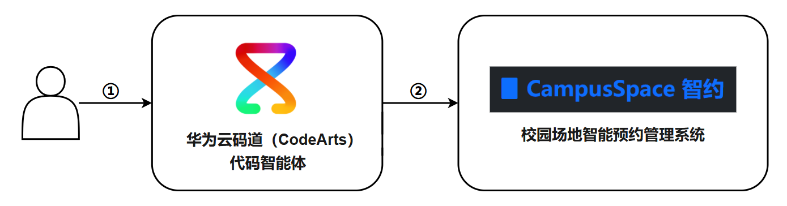**

说明：

1. 本地安装华为云码道（CodeArts）代码智能体；
2. 通过码道开发校园场地智能预约管理系统，并在浏览器中体验。

## 1.5 资源总览

本案例预计花费**0元**（使用免费资源和开发环境）。体验完成后请及时释放资源，避免产生多余的费用。

| **资源名称** | **规格** | **单价（元）** |
| --- | --- | --- |
| <a href="https://support.huaweicloud.com/obs/index.html" target="_blank">华为云对象存储服务OBS</a> | 标准存储 5GB | 免费（按需付费） |
| Redis缓存服务 | 本地Redis或云服务 | 免费 |
| <a href="https://codearts.huaweicloud.com/?source=dmzntgwds&sourcead=dmzntgwalzx" target="_blank">华为云码道（CodeArts）代码智能体</a> | 体验版（专业版） | 免费（按需付费） |

# 二、环境和资源准备

## 2.1 下载安装CodeArts代码智能体

参考<a href="https://devstation.connect.huaweicloud.com/space/devportal/casecenter/9afd09c74ff44b64bc0c7c6e375109e2/1" target="_blank">《AI IDE华为云码道（CodeArts）代码智能体安装部署》，下载安装IDE:

**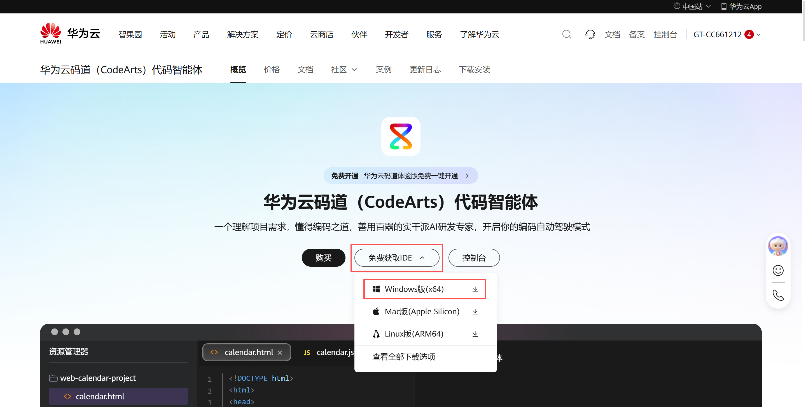**

## 2.2 开通华为云码道体验版

访问<a href="https://developer.huaweicloud.com/codeartsco.html?source=dmzntgwds&sourcead=alzxmdyjktnb" target="_blank">专属开通链接，免费开通华为云码道（CodeArts）代码智能体体验版：

**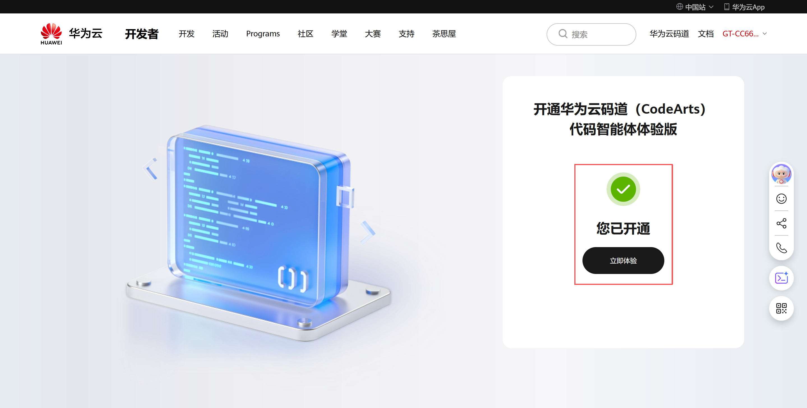**

## 2.2 登录CodeArts代码智能体

安装完成之后，点击打开文件夹或新建项目，用于存放项目文件：

**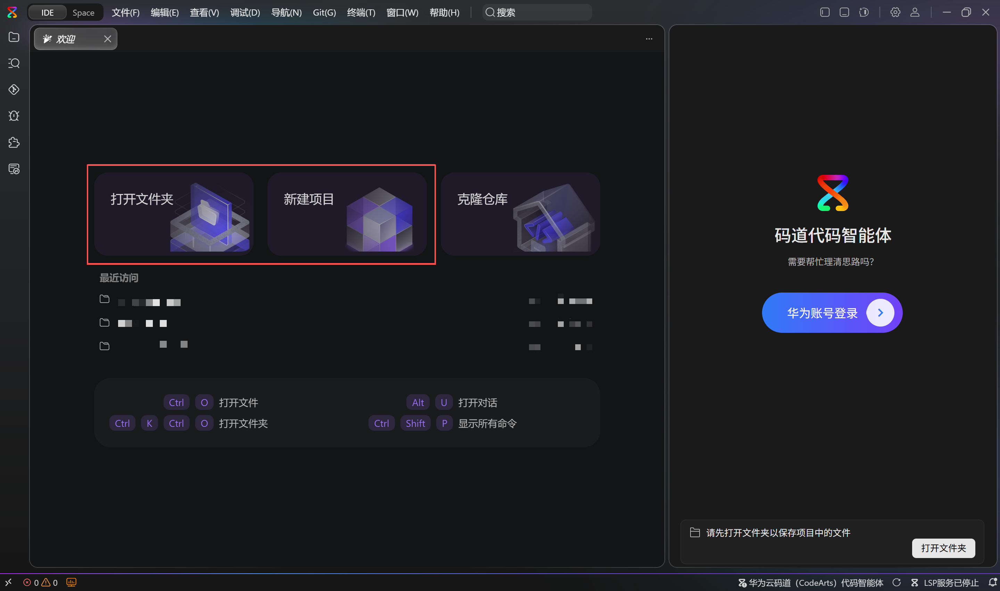**

登录CodeArts代码智能体：

**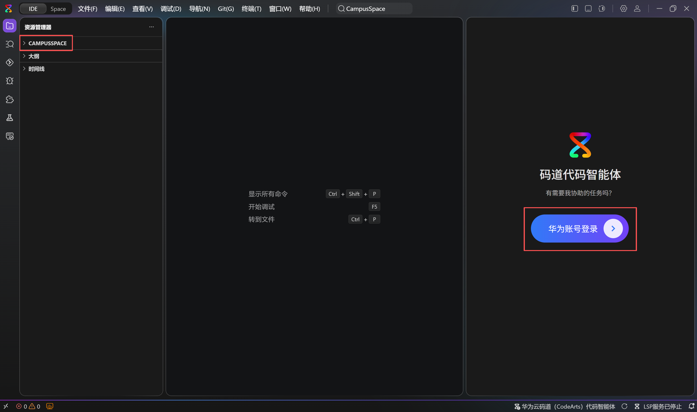**

注意：如果已经登录华为账号，直接跳转至登录授权页面，否则，直接拉起华为账号登录界面。
自动拉起华为账号登录界面，输入账号和密码：

**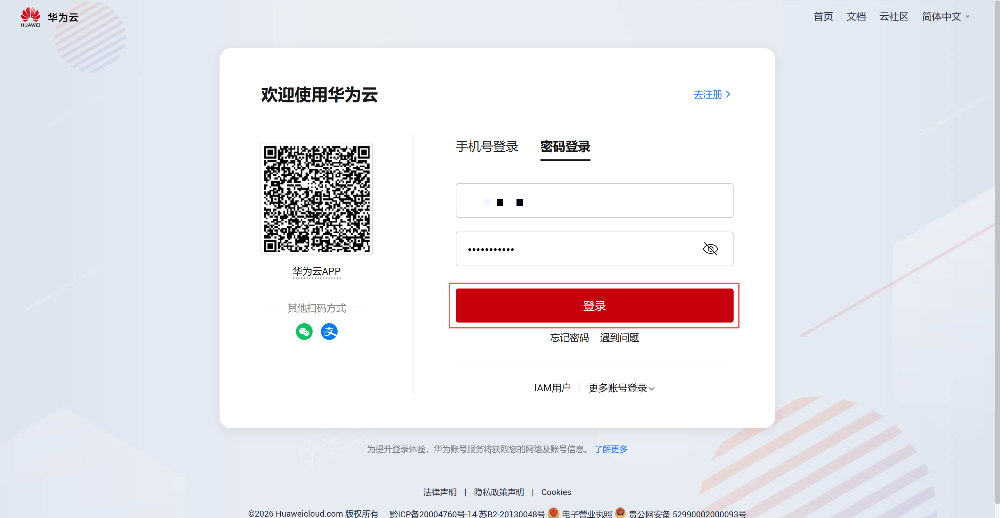**

跳转至登录授权页面，点击确认授权：

**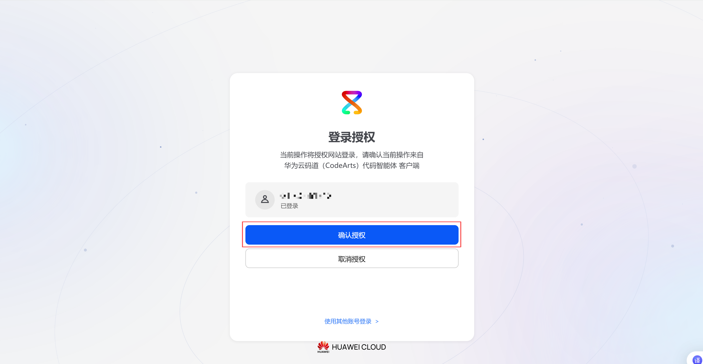**

CodeArts代码智能体登录成功：

**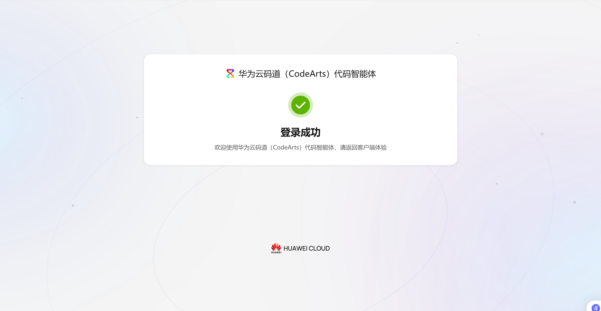**

登录成功之后，返回CodeArts代码智能体，即可体验使用。

# 三、通过码道分阶段搭建校园场地智能预约管理系统

## 3.1 需求规格设计

在码道对话框输入以下提示词，让码道进行需求规格说明书的创建：

你是一名资深产品经理、Django架构师和测试工程师。

我要开发 CampusSpace 智约——校园教室与会议室智能预约及冲突优化平台。

项目目标：
学生或教师输入使用时间、人数和设备需求，系统自动推荐合适场地；
支持固定课表、维修停用、临时预约、冲突检测、审批、取消和利用率统计。

用户角色：
1. 普通用户：查询场地、获取推荐、提交预约、查看和取消预约。
2. 管理员：管理场地、固定课表、维修时间、审批预约和查看统计。

技术栈：
Python、Django、Bootstrap、FullCalendar、Chart.js。
本地使用SQLite，部署时可切换MySQL或PostgreSQL。

现在先不要写代码，请依次输出：
1. 需求规格说明书
2. 功能优先级P0/P1/P2
3. 用户故事与验收标准
4. 页面清单
5. 数据表设计
6. 预约状态机
7. 冲突检测规则
8. 推荐算法
9. 项目目录结构
10. 分阶段开发任务清单

请将结果分别保存到docs目录中的Markdown文件。
存在模糊或矛盾的业务规则时先列出问题，不要自行假设。

此时，码道会根据步骤创建多个开发文档。

**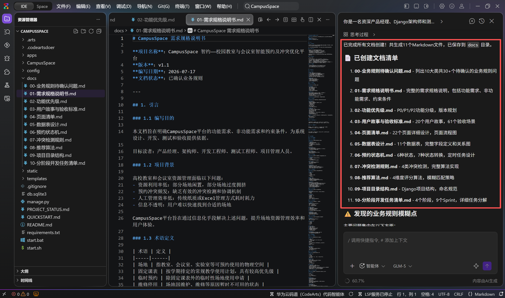**

这时，我们查看00-业务规则待确认问题.md，并确认业务规则，将修改后的文件发送给码道，码道会根据业务规则完善关键文档。

**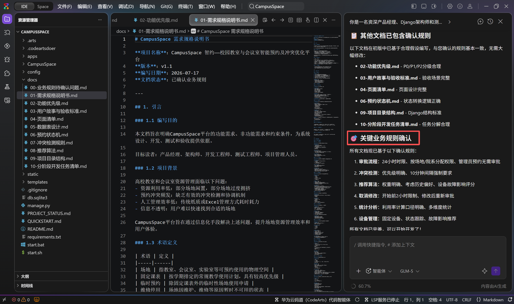**

## 3.2 生成项目结构和配置文件

在码道对话框输入以下提示词，让码道生成项目结构和配置文件：

请根据docs目录中的需求和设计文件，创建Django项目骨架。

本阶段只完成：
1. 项目初始化
2. 用户登录与退出
3. 管理员和普通用户权限
4. Building与Room数据模型
5. Django管理后台
6. 基础导航和首页
7. 初始化演示数据命令
8. README启动说明

**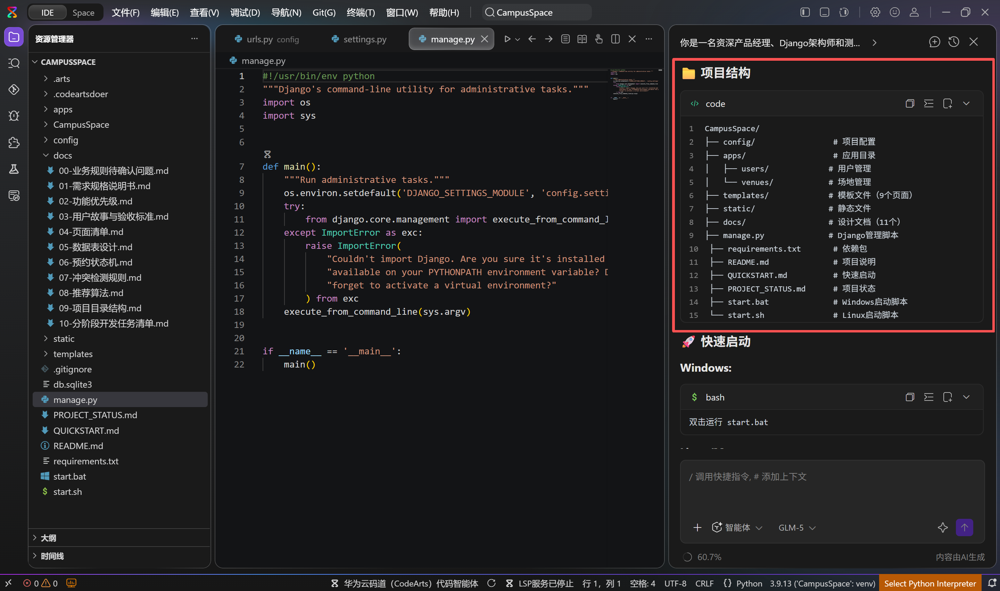**

## 3.3 安装Python开发环境

**步骤1：安装Python 3.9**

访问<a href="https://www.python.org/downloads/release/python-390/" target="_blank">Python官网下载并安装Python 3.9版本，确保pip包管理工具可用。

**步骤2：创建虚拟环境**

在项目目录下创建虚拟环境，隔离项目依赖：

```bash
# Windows
python -m venv CampusSpace
CampusSpace\Scripts\activate

# Linux/Mac
python3 -m venv CampusSpace
source CampusSpace/bin/activate
```

**步骤3：安装Django框架**

安装Django 3.2 LTS版本及项目依赖：

```bash
pip install Django==3.2.*
pip install django-crispy-forms==1.14.0
pip install crispy-bootstrap5==0.7
pip install Pillow==9.5.*
pip install python-dateutil==2.8.*
```

## 3.4 完善核心功能模块

在码道对话框输入以下提示词，继续完善核心功能模块。

接下来请根据docs目录中的需求和设计文件，实现：

1. 教学楼管理
2. 教室管理
3. 设备条件
4. 固定占用
5. 维修停用

**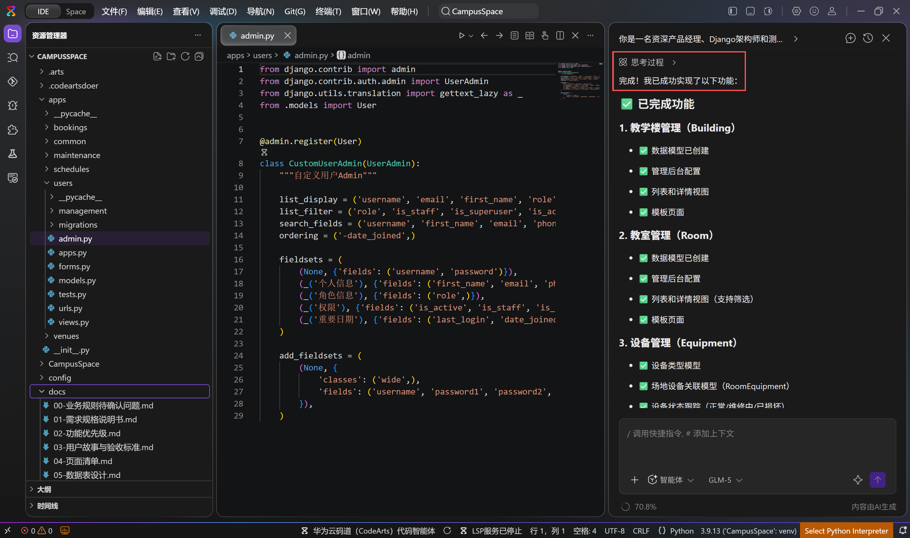**

## 3.5 结合Skill实现预约系统

## 3.5.1 实现预约功能

在码道对话框输入以下提示词，继续完善核心功能模块。由于预约功能涉及规则较多，需要进行确认后再实现。

请调用booking-domain Skill，实现预约核心功能。

要求：
1. 用户选择场地、日期、开始时间和结束时间。
2. 校验开始时间早于结束时间。
3. 校验人数不超过场地容量。
4. 校验设备要求。
5. 校验固定课表冲突。
6. 校验维修时间冲突。
7. 校验已批准预约冲突。
8. 校验同一用户的时间冲突。
9. 冲突时不写入预约数据。
10. 返回明确的冲突原因。
11. 无冲突时创建待审批预约。
12. 为所有规则编写单元测试。

请先说明实现方案和涉及文件，等待我确认后再修改代码。

**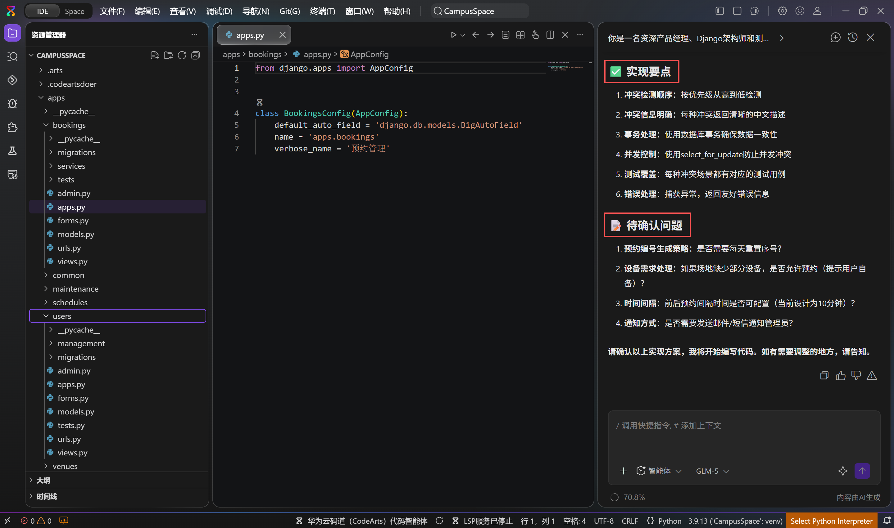**

确认所有问题后，码道会根据完整的冲突检测规则实现预约功能。

**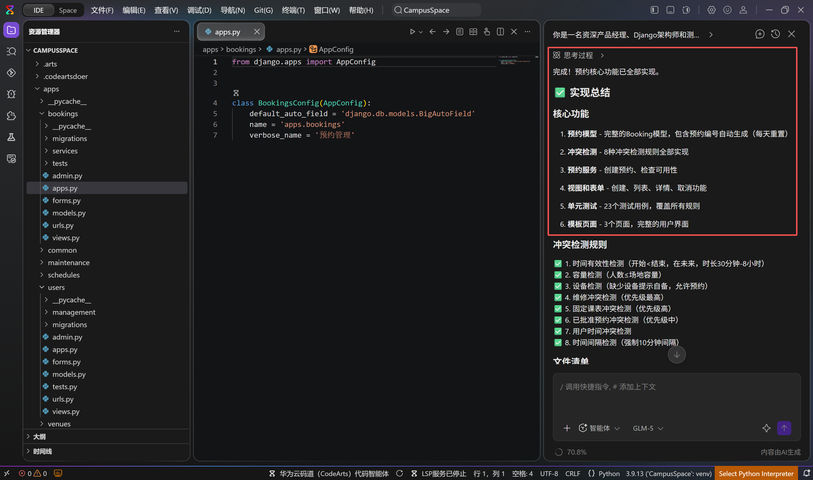**

## 3.5.2 实现场地推荐功能

在码道对话框输入以下提示词，加入场地推荐功能。

在现有预约系统中实现可解释的场地推荐。

推荐流程：
1. 根据时间冲突、容量、设备和场地状态进行硬性筛选。
2. 对剩余场地计算100分推荐分。
3. 容量匹配35分、设备匹配25分、建筑偏好15分、
   空闲连续性15分、节能匹配10分。
4. 返回排名前三的场地。
5. 每个结果必须提供推荐理由和扣分原因。
6. 无合适场地时，推荐最近的可用时间或替代场地。
7. 推荐逻辑与视图层分离。
8. 为排序、并列和无结果场景编写测试。

**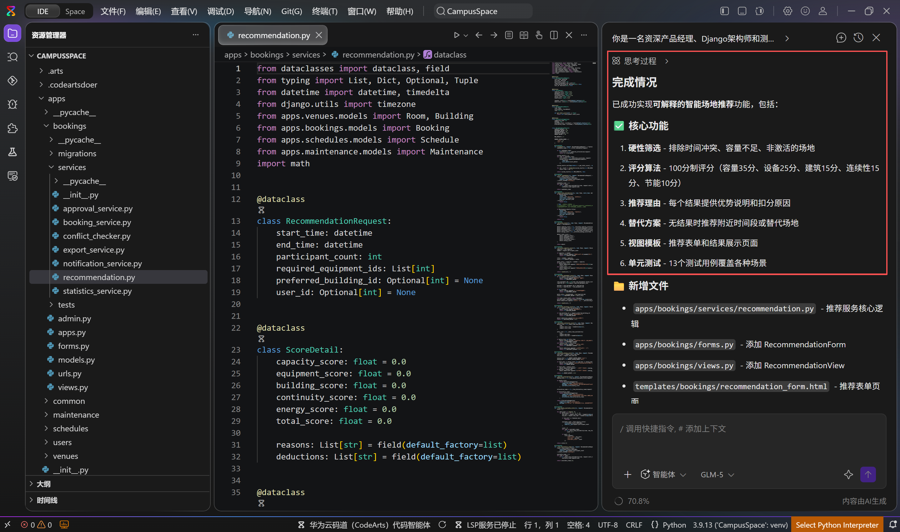**

## 3.5.3 实现审批流程和日历视图功能

在码道对话框输入以下提示词，实现审批流程和日历视图功能。

实现：

- 管理员审批列表
- 同意和拒绝
- 拒绝原因
- 用户个人预约
- 取消预约
- 周日历和月日历
- 不同状态颜色显示

**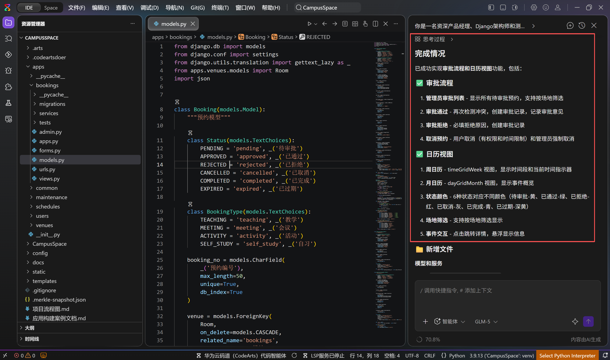**

## 3.5.4 实现统计分析功能

在码道对话框输入以下提示词，采用服务层设计模式，实现统计分析功能。

先生成 SQL/ORM 设计，再生成图表接口，避免统计逻辑散落在页面里。

并验证：

- 没有数据时页面不报错
- 只有一条数据时图表正常
- 已取消预约不计入有效利用率
- 固定课表和临时预约是否分别统计

**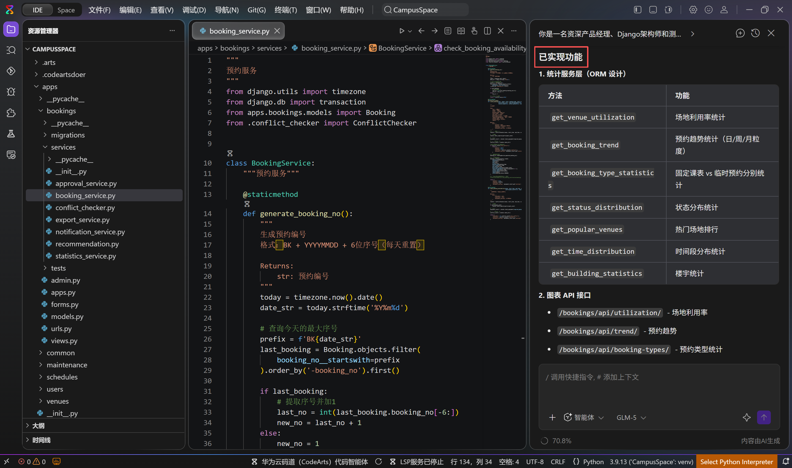**

## 3.6 添加华为云OBS和Redis集成

## 3.6.1 配置华为云OBS服务

**步骤1：开通华为云OBS服务**

登录<a href="https://console.huaweicloud.com/obs" target="_blank">华为云控制台</a>，开通对象存储服务OBS。

**步骤2：创建OBS桶**

在OBS控制台创建存储桶，用于存储系统上传的文件：

- 桶名称：`campusspace-files`
- 区域：华北-北京四
- 存储类别：标准存储
- 桶访问权限：公共读

**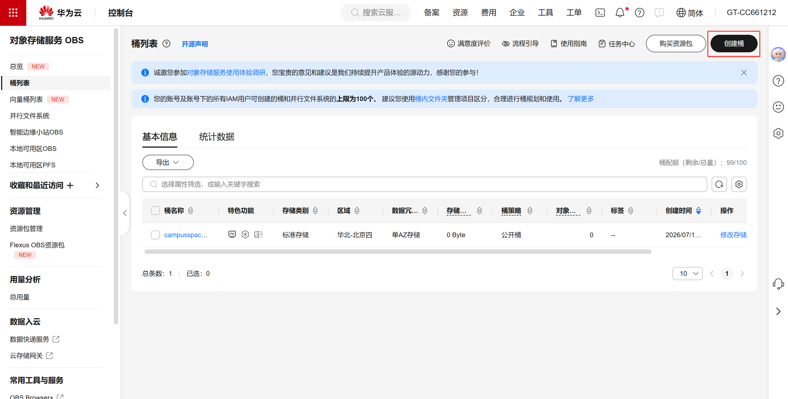**

**步骤3：获取访问密钥**

在"我的凭证"页面获取访问密钥（AK/SK），用于程序访问OBS服务：

**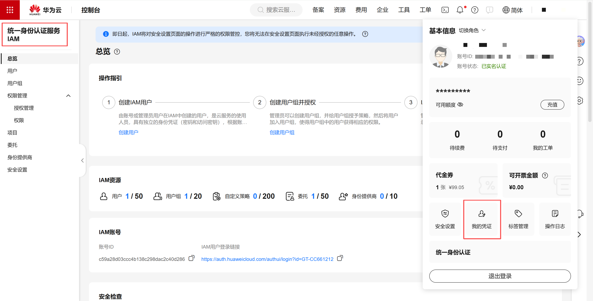**

**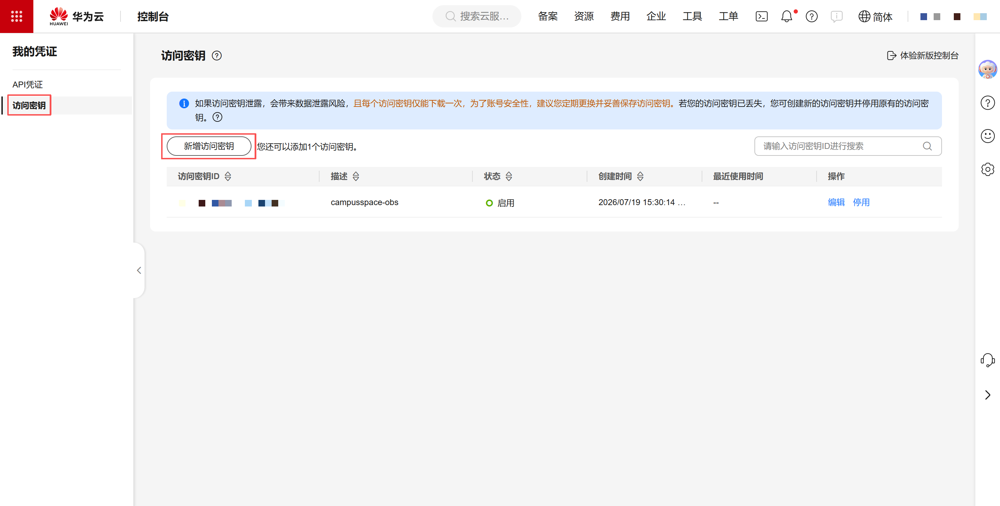**

**步骤4：安装OBS SDK**

安装华为云OBS Python SDK：

```bash
pip install esdk-obs-python
```

**步骤5：配置环境变量**

设置OBS访问密钥环境变量：

```bash
# Windows (PowerShell)
$env:HUAWEI_ACCESS_KEY="你的AK"
$env:HUAWEI_SECRET_KEY="你的SK"

# Linux/Mac
export HUAWEI_ACCESS_KEY="你的AK"
export HUAWEI_SECRET_KEY="你的SK"
```

## 3.6.2 安装Redis缓存服务

**步骤1：安装Redis**

Windows用户下载Redis Windows版本，Linux/Mac用户使用包管理器安装：

```bash
# Ubuntu/Debian
sudo apt-get install redis-server

# CentOS/RHEL
sudo yum install redis

# Mac
brew install redis
```

**步骤2：启动Redis服务**

```bash
# Windows
redis-server.exe

# Linux/Mac
redis-server
```

**步骤3：安装Django Redis**

```bash
pip install django-redis==5.4.0
pip install redis==5.0.1
```

## 3.6.3 配置项目设置

编辑`config/settings.py`，配置项目设置：

```python
# 华为云OBS配置
HUAWEI_OBS_CONFIG = {
    'access_key': os.environ.get('HUAWEI_ACCESS_KEY'),
    'secret_key': os.environ.get('HUAWEI_SECRET_KEY'),
    'server': 'obs.cn-north-4.myhuaweicloud.com',
    'bucket_name': 'campusspace-files'
}

# Redis缓存配置（开发环境使用本地内存）
if DEBUG:
    CACHES = {
        'default': {
            'BACKEND': 'django.core.cache.backends.locmem.LocMemCache',
            'LOCATION': 'unique-snowflake',
        }
    }
else:
    CACHES = {
        'default': {
            'BACKEND': 'django_redis.cache.RedisCache',
            'LOCATION': 'redis://127.0.0.1:6379/1',
            'OPTIONS': {
                'CLIENT_CLASS': 'django_redis.client.DefaultClient',
            },
            'KEY_PREFIX': 'campusspace',
            'TIMEOUT': 300,
        }
    }
```

## 3.6.4 实现华为云 OBS	与 Redis 缓存功能

在码道对话框输入以下提示词，实现技术提升。

添加以下重要功能和技术提升：
使用华为云 OBS
添加 Redis 缓存
创建 API 文档

**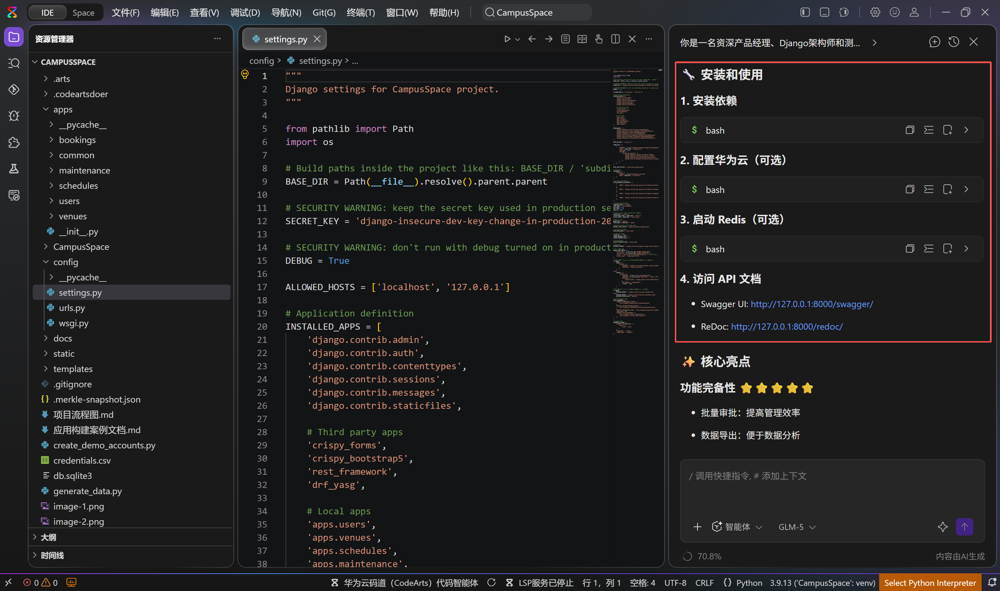**

# 四、启动项目并反馈可能出现的问题

在编码任务完成后，根据启动说明启动项目，检查是否正常运行。

注意：在启动项目中或项目运行中可能会出现一些错误，遇到问题的时候我们通过自然语言描述或者截图的方式把错误直接反馈给码道，让码道帮我们解决就可以了。

也可以按照个人习惯增加其他的功能，比如批量审批、数据导出、站内消息等，让系统更加完善。

注意：由于本应用是由AI创建，每次创建的结果可能不一致，如果想体验上图中的案例，可在本项目源码处下载并体验。

# 五、反馈改进建议

如您在案例实操过程中遇到问题或有改进建议，可以到<a href="https://bbs.huaweicloud.com/forum/forum-0120157023154615007-1.html" target="_blank">开发者论坛评论区反馈，我们会及时响应处理，谢谢！

# 六、扩展资料

- <a href="https://docs.djangoproject.com/" target="_blank">Django官方文档</a>
- <a href="https://support.huaweicloud.com/obs/index.html" target="_blank">华为云OBS文档</a>
- <a href="https://redis.io/documentation" target="_blank">Redis官方文档</a>
- <a href="https://www.django-rest-framework.org/" target="_blank">Django REST Framework文档</a>