# CampusSpace 项目流程图

## 一、总体开发流程图

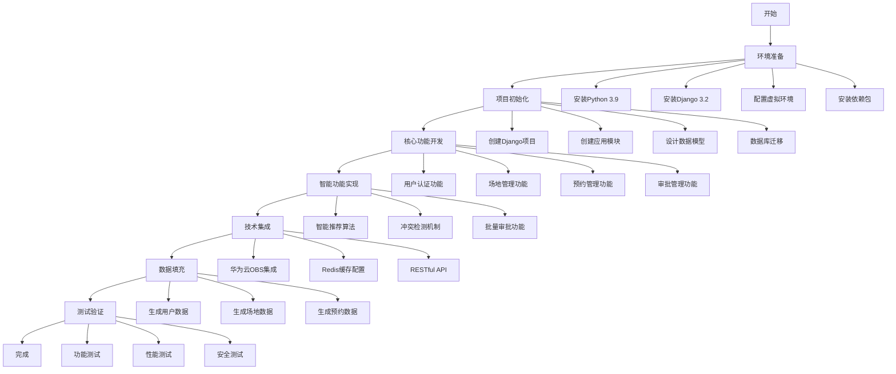

---

## 二、系统架构流程图

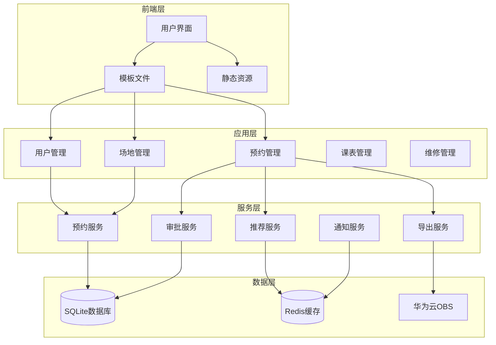

---

## 三、用户操作流程图

### 3.1 预约流程

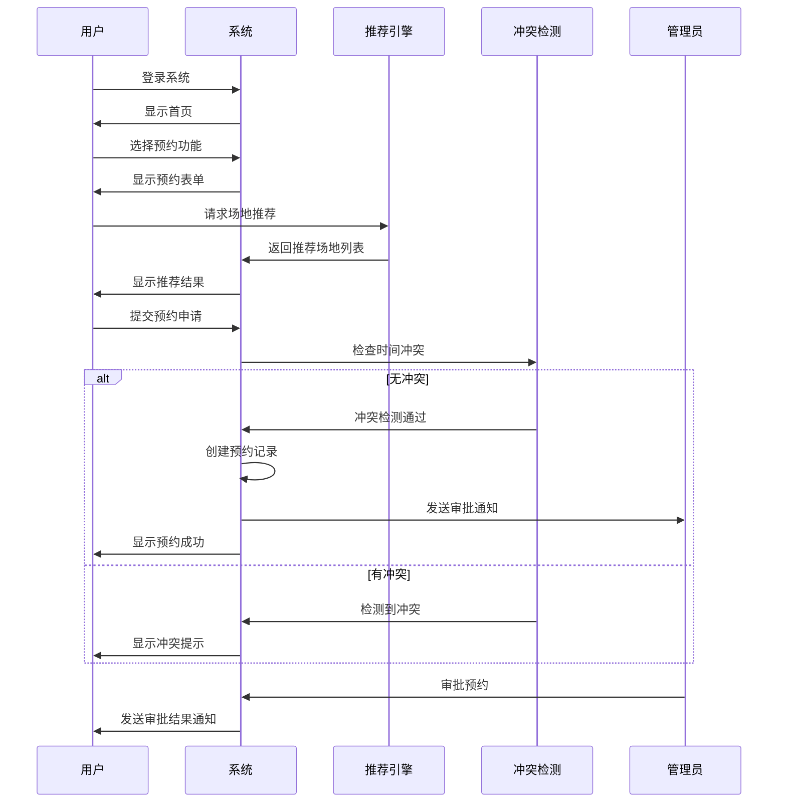

### 3.2 审批流程

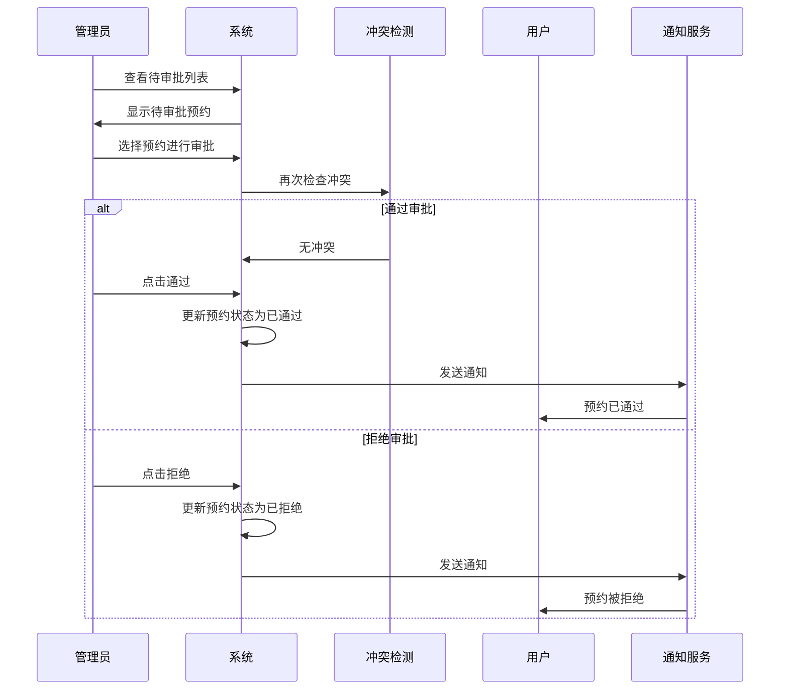

---

## 四、数据流程图

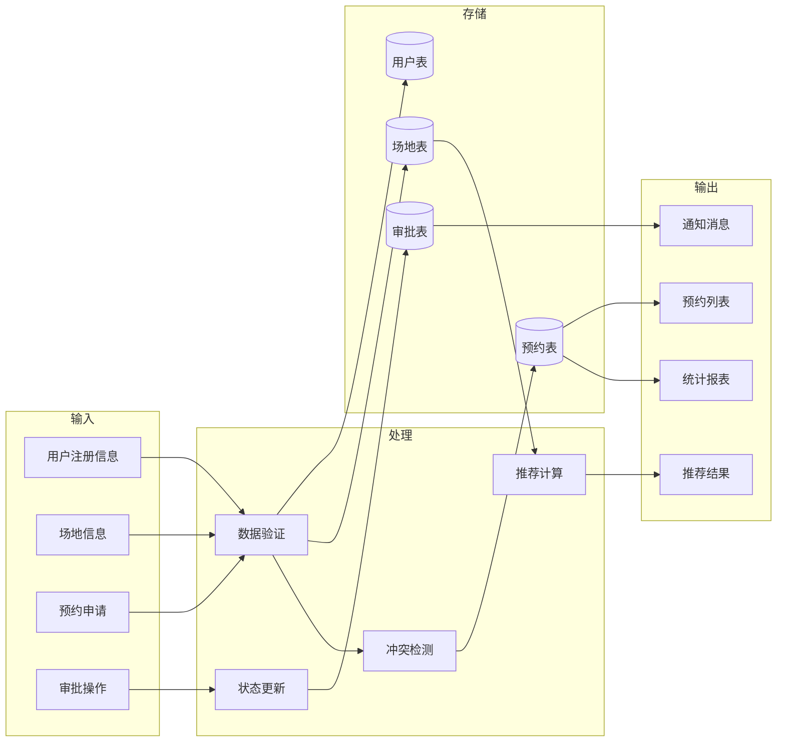

---

## 五、技术架构图

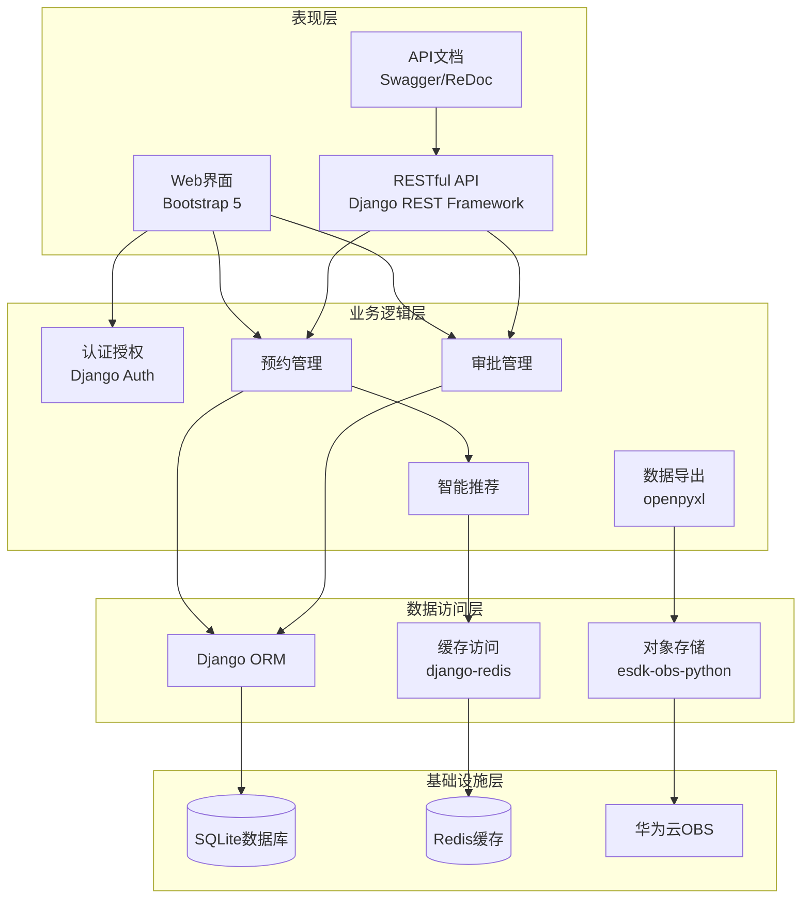

---

## 六、模块依赖关系图

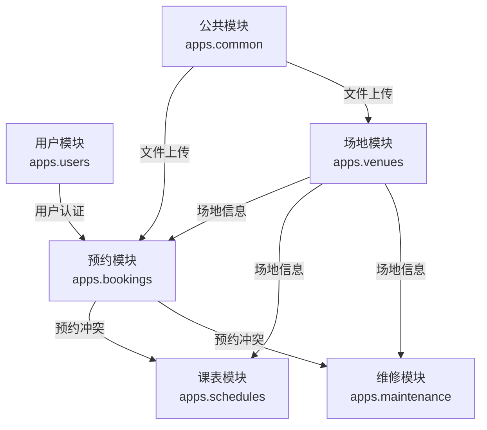

---

## 七、智能推荐算法流程图

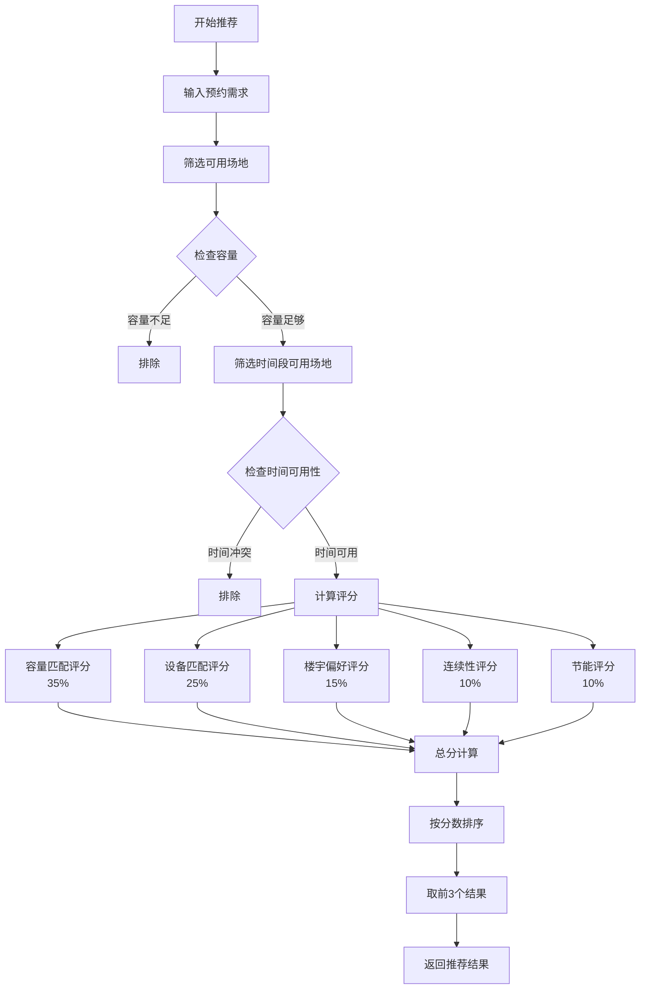

---

## 八、冲突检测流程图

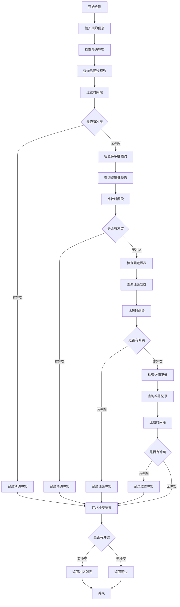

---

## 九、批量审批流程图

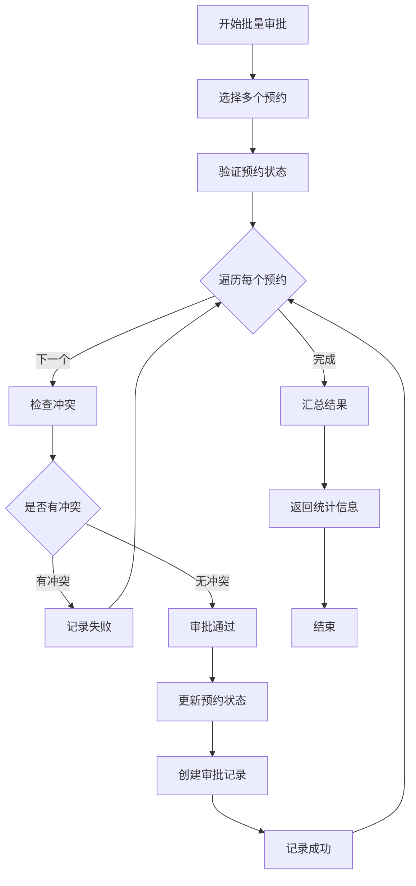

---

## 十、系统部署流程图

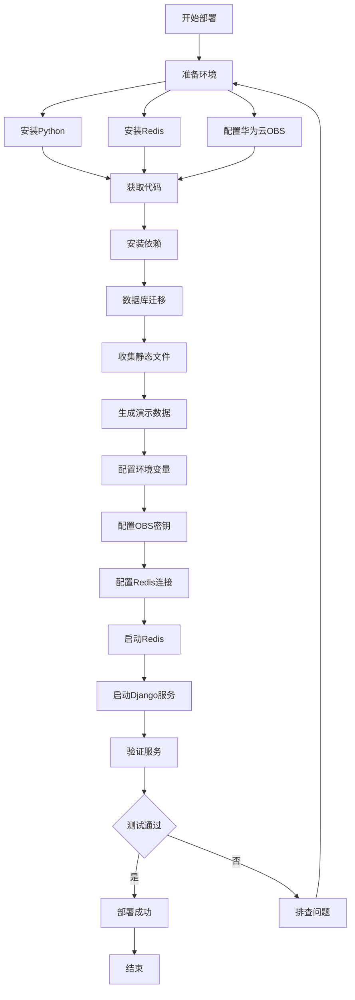

---

## 使用说明

### 如何使用这些流程图

1. **Mermaid格式**：上述流程图使用Mermaid语法编写，可在支持Mermaid的Markdown编辑器中直接渲染

2. **在线渲染**：
   - 访问 <a href="https://mermaid.live/" target="_blank">Mermaid Live Editor</a>
   - 复制流程图代码到编辑器
   - 导出为PNG或SVG图片

3. **IDE支持**：
   - VS Code：安装"Markdown Preview Mermaid Support"插件
   - JetBrains IDE：原生支持Mermaid语法

4. **文档插入**：
   - 将渲染后的图片保存
   - 在案例文档中插入图片

### 推荐工具

- **Mermaid Live Editor**：https://mermaid.live/
- **Draw.io**：https://app.diagrams.net/
- **ProcessOn**：https://www.processon.com/

---

**创建时间**：2026-07-20  
**流程图数量**：10个  
**格式**：Mermaid语法